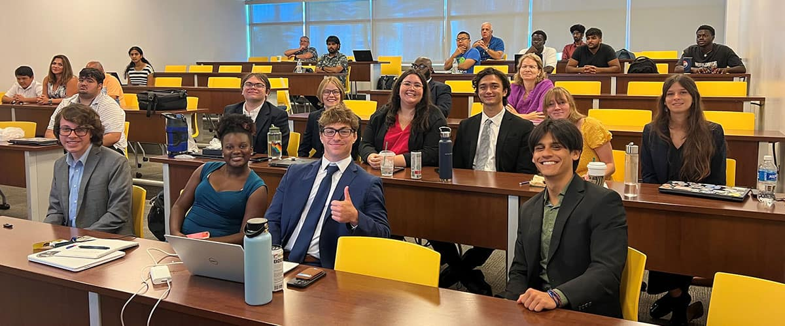

<h1 style="font-size: 3rem;">Work Experience</h1>

## [XR Lab Developer (May 2025 – Present)](https://daytonabeach.erau.edu/about/labs/extended-reality)

<!-- {:.lead width="1920" height="1080" loading="lazy"} -->

As a Lead Developer at the Extended Reality (XR) Lab, I lead the development of applications from concept to deployment and maintenance for the College of Aviation. This includes creating the 'Immersive Flight Dynamics' application, a high-fidelity simulation that integrates the YAW Motion Simulator, Meta Quest 3 headset, and physical flight controls to train and experience flight maneuvers like stall and spin recovery. Furthermore, I optimized the development pipeline by creating a flexible and reusable 'Interactive Cessna 172' package by adapting the OpenXR SDK and custom flight control scripts. Moreover, I wrote System and Technical Design Documents for current and future projects in the lab.

Essentially my work involves Human-Computer Interaction (HCI), hardware-software integration, and gamified learning in a simulation environment.

<h1 style="font-size: 3rem;">Research</h1>

## [NSF REU Intern (May 2024 – Jul 2024)](https://news.erau.edu/headlines/nsf-funded-program-at-embry-riddle-promotes-undergraduate-research-nationwide)

{:.lead width="1920" height="1080" loading="lazy"}

I conducted mechanical characterization of self-healing PDMS-based polymers through tensile testing to evaluate healing efficiency. During this process, I discovered a 30% increase in healing performance when alcohol was introduced during the repair process. I developed Python scripts to automate the analysis of force and distance data, which saved over 10 hours per week while improving the accuracy of stress and strain calculations through repeatable tests. Additionally, I integrated a sensor and an Arduino microcontroller into the tensile tester, enabling real-time distance measurement that improved strain rate precision by 15%.

<h1 style="font-size: 3rem;">Presentations</h1>
*Investigating the Relationship of Molecular Attributes and Intrinsic Self-Healing Efficiency in PDMS 
Based Polymers With Application Towards Coatings in UAVs.* AIAA SciTech Forum January 8, 2025

*Self-Healing Sensors for Advanced Health Monitoring* 40th Southern Biomedical Engineering Conference, September 13-15, 2024

*Determination of Self-healing Efficiency for PDMS Based Polymers* NSF-REU Embry-Riddle Aeronautical University Poster Presentations, July 17, 2024

<h1 style="font-size: 3rem;">Prior Experience</h1>
## Physics Tutor (Sept 2023 - Sept 2025)
I boosted the student pass rate by 9% in introductory physics courses over the course of a year. I instruct up to 40 students at a time on core concepts and numerical questions, emphasizing group engagement to enhance learning. I collaborate with co-tutors to align sessions with course objectives, adjusting pacing and structure to optimize student learning outcomes.
