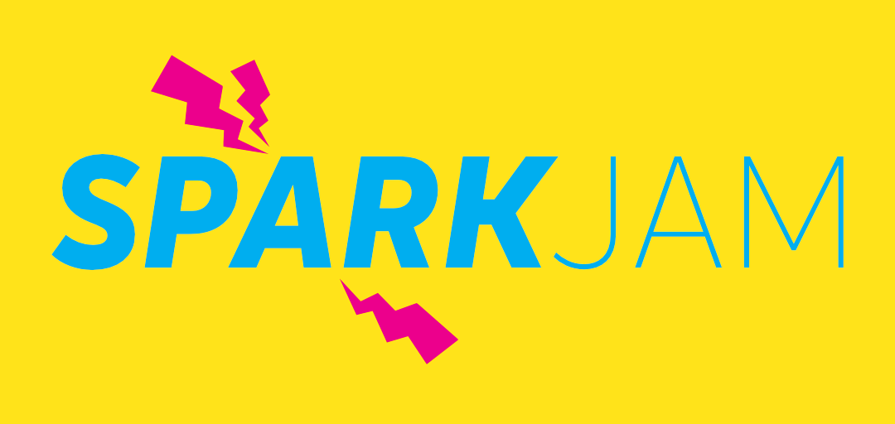

{:.lead width="1920" height="1080" loading="lazy"}

Hi, I’m Logan Shaffer, an undergraduate student at Embry-Riddle Aeronautical University, where I’m pursuing a degree in Engineering Physics with a concentration in Spacecraft Instrumentation. This program combines space systems engineering and space physics, providing me with a strong foundation in mathematics, engineering, and applied sciences. My concentration further focuses on electrical engineering and programming, equipping me with skills aimed at instrumentation and software design. Although my academic background isn’t the traditional route to software development, it has sharpened my analytical thinking, adaptability, and ability to tackle versatile technical challenges.

I am passionate about coupling my technical expertise with creativity. Whether it’s developing an indie game or exploring cutting-edge technologies, I thrive in environments where curiosity meets innovation.

In my free time, I enjoy rock climbing, playing tabletop games with friends, and working on game projects that excite me. I also love to travel and learn about different cultures and languages.

# News & Updates:
I recently partipated in the first annual ERAU SparkJam event. Click on the image to learn more!
[{:.lead width="685" height="425" loading="lazy"}](http://localhost:4000/projects/#spark-jam-2025---tainted-blood-feb-2025)

> Check out the following pages to see what i've accomplished! — [Experience](http://localhost:4000/experience/), [Projects](http://localhost:4000/projects/), and [Curriculum Vitae](http://localhost:4000/cv/).
{:.lead}

