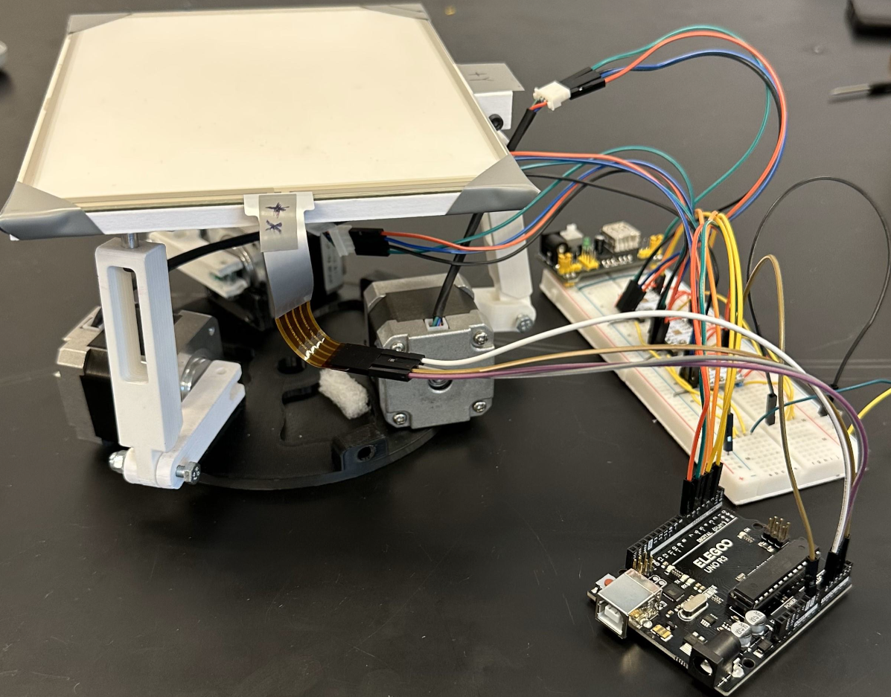
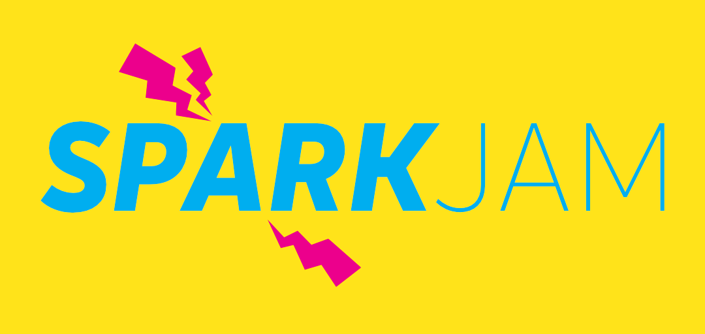
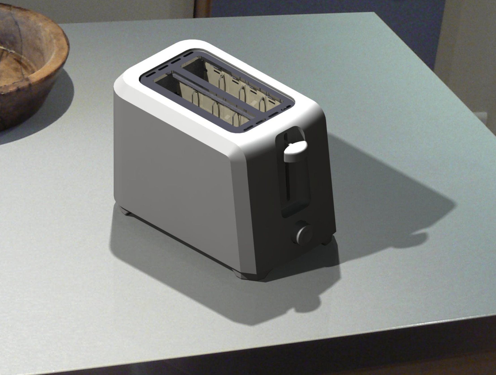

## [Senior Design Project - Graphical User Interface (Jan 2025 - Apr 2025)](https://github.com/drlogan42/mDLP-Senior-Design)
{:.lead width="685" height="425" loading="lazy"}

Showing the features of the working program.

I created a Graphical User Interface that uses Python and Julia to simulate data from an instrument, display real-time graphs, record trials, and playback saved data from a CSV file. This project is a subsystem of a larger senior design project that spans two semesters. The GUI will function as the all-in-one software, taking inputs from an mDLP (miniature Dual Langmuir Probe) instrument while being tested inside a plasma chamber. Thus far, there is a working build for the GUI with all functioning features. However, the backend is planned to be converted from Python to a mainly Julia backend for a highly efficiency data handling system for the science data. The end result of the project will be a Python frontend and Julia backend for a proof of working dual language highly efficient GUI to handle incoming data, display, and perform functions of analysis, saving, and playback.

## [Junior Design Project - Ball Balancing Platform (Jan 2025 - Apr 2025)](https://github.com/drlogan42/EP340-Junior-Design)
{:.lead width="685" height="425" loading="lazy"}

The ball balancing platform in all of its glory.

I, alongside two others created a ball balancing platform for our junior design project. The platform reacts to any inputs atop a resistive screen which reads inputs, sends them to an Arduino, calculates the position of the stepper motors to turn and moves the platform in a way that balances a steel ball when rolled onto the top. I programmed the algorithms for the Inverse Kinematics which determined the position the arms must be oriented in order to move the ball to the platform. I also coded the PID algorithm, which found how much the ball needed to move to get to the center. All programming was in C++ using Arduino and CAD was modelled using Fusion 360.

## [Project S.H.I.N.E – Microcomputers & Electronics Final Project (Jan 2025 - Apr 2025)](https://github.com/drlogan42/EP340-Junior-Design)
In my Microcomputers and Electronics Instrumentation course, my final project was building project S.H.I.N.E. or Solar Harnessing Intelligent Navigator for Exploration, a CubeSat like apparatus that is an environment sensing sun tracker. My team built the tracker in C using an AVR microcontroller to remotely monitors power, temperature, direction, and light levels to accurately swivel to track an artificial light source while displaying data in real time to a ground station. I was in charge of constructing the power and monitoring subsystems that precisely track all voltage and current levels in the project.

## [Spark Jam 2025 - Tainted Blood (Feb 2025)](https://drlogan42.itch.io)
{:.lead width="685" height="425" loading="lazy"}

Embry-Riddle Aeronautical University's first annual SparkJam.

I participated in the first annual ERAU SparkJam event hosted by the Game Development club. The theme of the Jam was "Vampirism" and teams were given 42hrs to complete a video game. I worked as a solo developer where I utilized my prior programming experience and leveraged it with GSScript in the Godot Engine. I gained valuable experience with prototyping, game mechanics, iteration, storyboarding, level design, and 2D asset design. Additionally, the pressure of a 42hr deadline gave me crucial experience with adaptability, decision making, time management, and designing the overall direction of the game.

## [IEEEXtreme Programming Competition (Oct 2024)](https://ieeextreme.org)
ERAU ranked in the top 37% of over 8,000 global teams in a 24-hour programming competition. I collaborated with my team to solve coding challenges, where we optimized algorithms for speed and efficient memory usage in Python, C, and C++.

## [Differential Equations Honors Project (Jan 2024 – May 2024)](diffeq.md)
I engineered a Python program that simulates the behavior of 10 unique mass-spring systems using data visualization libraries. This program provides graphical representations of second-order differential equations, serving as a valuable learning tool for future engineering students.

## [NASA RASC-AL Competition (Jan 2024 – May 2024)](chonk.md)
I conducted collaborative research with a team of 50 students, focusing on design and innovative concepts to enhance human space exploration. I computed and plotted mission trajectories for launch, transfer orbit, reentry, and landing using MATLAB.

## Graphical Communications Final Project (Aug 2023 - Dec 2023)
{:.lead width="685" height="425" loading="lazy"}

Final rendering of the toaster model with shading.

I designed a realistic 3D CAD model of a toaster in CATIA V5 with accurate dimensions. I also rendered the simulated model using Houdini SideFX and animated the moving components with lifelike textures and shaders.
